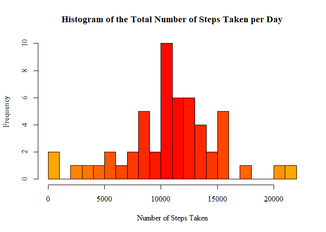
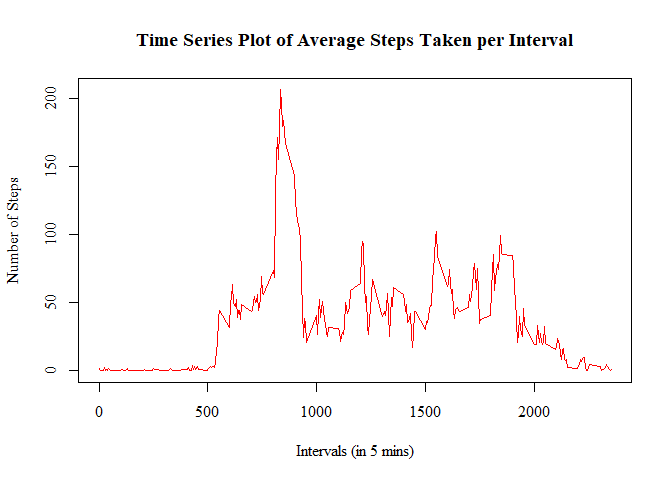
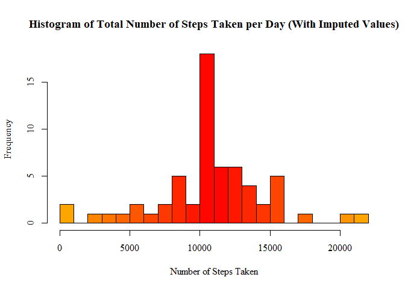
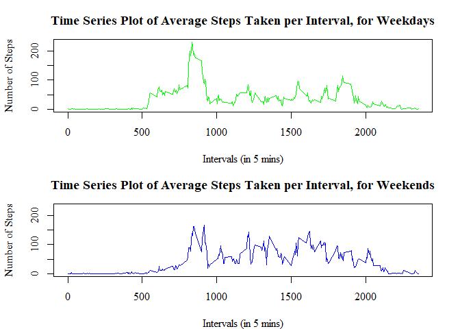

This R Markdown document has been created for "Peer Assessment 1" of the course "Reproducible Research" on Coursera. The R Markdown document evidences literate programming using markdown and R programming techniques. The data used for this is called "activity monitoring data".

## About the Data

The data is derived from a study where a single individual wore a "personal activity monitoring device". The data consists of the number of steps taken by the individual in 5 minute intervals.Two months of data from October and November 2012 are included in the dataset. The csv file containing the data has three variables.The first variable is the number of steps taken, the second variable is the date, and the third variable is the time interval.

## Loading and preprocessing the data

The data must be in the user's current working directory for the code to run correctly. The **unzip()** function extracts the data from the zip file, before it is read into R. The column variable types are defined to speed up the process.


```r
unzip("activity.zip")
initialData <- read.csv("activity.csv", colClasses=c("numeric", "Date", "numeric"))
```

The **head()** function can be used to have a look at some of the first rows of the dataset and the **str()** function can be used to generate a summary of it. The values confirm that the data types passed to the **read.csv()** function are correct.


```r
head(initialData)
```

```
##   steps       date interval
## 1    NA 2012-10-01        0
## 2    NA 2012-10-01        5
## 3    NA 2012-10-01       10
## 4    NA 2012-10-01       15
## 5    NA 2012-10-01       20
## 6    NA 2012-10-01       25
```

```r
str(initialData)
```

```
## 'data.frame':	17568 obs. of  3 variables:
##  $ steps   : num  NA NA NA NA NA NA NA NA NA NA ...
##  $ date    : Date, format: "2012-10-01" "2012-10-01" ...
##  $ interval: num  0 5 10 15 20 25 30 35 40 45 ...
```

## What is mean total number of steps taken per day?

As there are missing values in the dataset (coded as **NA**), these can be removed before further analysis.


```r
data <- initialData[!(is.na(initialData$steps)), ]
```

The **aggregate()** function is used to group the data according to the date variable and take the sum of each group to find the number of steps taken per day, and the **head()** function is then used to take a look at the first few lines of the new dataset.


```r
totalStepsDay <- aggregate(steps ~ date, data, sum)
head(totalStepsDay)
```

```
##         date steps
## 1 2012-10-02   126
## 2 2012-10-03 11352
## 3 2012-10-04 12116
## 4 2012-10-05 13294
## 5 2012-10-06 15420
## 6 2012-10-07 11015
```

The histogram below shows the number of steps taken each day.


```r
paletteBlue <- colorRampPalette(c("orange", "red", "orange"))
hist(totalStepsDay$steps, breaks=20, xlab="Number of Steps Taken", 
     main="Histogram of the Total Number of Steps Taken per Day",
     col=paletteBlue(22), family="serif")
```

<!-- -->

The **summarise()** function is then used to calculate the mean and the median values of the total steps taken per day.


```r
library(dplyr)
```

```
## Warning: package 'dplyr' was built under R version 4.3.3
```

```r
totalStepsSummary <- summarise(totalStepsDay, meanOfTotalSteps=mean(totalStepsDay$steps),
                               medianOfTotalSteps=median(totalStepsDay$steps))
print(totalStepsSummary)
```

```
##   meanOfTotalSteps medianOfTotalSteps
## 1         10766.19              10765
```

From the summary, the mean value is **10766.19**, and the median value is **10765**.

## What is the average daily activity pattern?

A time series plot is used to measure the daily activity pattern. The **aggregate()** function is used to calculate mean of the data grouped by date.


```r
meanStepsInterval <- aggregate(steps ~ interval, data, mean)
head(meanStepsInterval)
```

```
##   interval     steps
## 1        0 1.7169811
## 2        5 0.3396226
## 3       10 0.1320755
## 4       15 0.1509434
## 5       20 0.0754717
## 6       25 2.0943396
```

The **plot()** function from the base plotting system can be used to create the time series plot.


```r
plot(x=meanStepsInterval$interval, y=meanStepsInterval$steps, type="l",
     main="Time Series Plot of Average Steps Taken per Interval",
     ylab="Number of Steps", xlab="Intervals (in 5 mins)",
     col="red", lwd=1.5, family="serif")
```

<!-- -->

Lastly, we find the maximum from the vector containing the daily average steps.


```r
meanStepsInterval[grep(max(meanStepsInterval$steps), meanStepsInterval$steps), ]
```

```
##     interval    steps
## 104      835 206.1698
```

So the interval with the maximum number of steps is interval **835**.

## Imputing missing values

As the data has been confirmed to contain **NA** values, the number of **NA** values must be checked before imputing.


```r
data.frame(steps=sum(is.na(initialData$steps)), 
           interval=sum(is.na(initialData$interval)), 
           date=sum(is.na(initialData$date)))
```

```
##   steps interval date
## 1  2304        0    0
```

It can be seen that all 2304 NA values are contained within the steps variable. To impute, the mean value of the steps variable across all days has been used.


```r
imputedData <- initialData
for(x in 1:17568) {
    if(is.na(imputedData[x, 1])==TRUE) {
        imputedData[x, 1] <- meanStepsInterval[meanStepsInterval$interval %in% imputedData[x, 3], 2]
    }
}
head(imputedData)
```

```
##       steps       date interval
## 1 1.7169811 2012-10-01        0
## 2 0.3396226 2012-10-01        5
## 3 0.1320755 2012-10-01       10
## 4 0.1509434 2012-10-01       15
## 5 0.0754717 2012-10-01       20
## 6 2.0943396 2012-10-01       25
```


```r
imputedTotalStepsDay <- aggregate(steps ~ date, imputedData, sum)
head(imputedTotalStepsDay)
```

```
##         date    steps
## 1 2012-10-01 10766.19
## 2 2012-10-02   126.00
## 3 2012-10-03 11352.00
## 4 2012-10-04 12116.00
## 5 2012-10-05 13294.00
## 6 2012-10-06 15420.00
```

A histogram can now be created using the imputed data.


```r
paletteRed <- colorRampPalette(c("orange", "red", "orange"))
hist(imputedTotalStepsDay$steps, breaks=20, xlab="Number of Steps Taken", 
     main="Histogram of Total Number of Steps Taken per Day (With Imputed Values)",
     col=paletteRed(22), family="serif")
```

<!-- -->

It can be seen that the frequency of values increases in the second histogram, which is expected, due to the imputed values. 

More explanations for the differences between the non-imputed and imputed data sets can be seen by looking at the NA values grouped by their date variable.


```r
naByDate <- initialData[is.na(initialData$steps), ]
table(naByDate$date)
```

```
## 
## 2012-10-01 2012-10-08 2012-11-01 2012-11-04 2012-11-09 2012-11-10 2012-11-14 
##        288        288        288        288        288        288        288 
## 2012-11-30 
##        288
```

There are exactly 288 intervals on each day as seen below.


```r
length(unique(data$interval))
```

```
## [1] 288
```

It is therefore shown by the above table, that in the initial data set, missing observations are due to entirely missed days, (8 of the days) where no measurements were made.

## Are there differences in activity patterns between weekdays and weekends?

The imputed data set is used to answer this problem. A new factor variable indicating whether a day is a "weekday" or a "weekend". The **weekdays()** function can be used in a for loop with an if-else condition to check for Saturdays and Sundays.


```r
daysData <- imputedData
daysData$days <- weekdays(daysData$date)
daysData$weekday <- as.character(rep(0, times=17568))
for(x in 1:17568) {
    if(daysData[x, 4] %in% c("Saturday", "Sunday")) {
        daysData[x, 5] <- "weekend"
    } else {
        daysData[x, 5] <- "weekday"
    }
}
daysData$weekday <- factor(daysData$weekday)
head(daysData)
```

```
##       steps       date interval   days weekday
## 1 1.7169811 2012-10-01        0 Monday weekday
## 2 0.3396226 2012-10-01        5 Monday weekday
## 3 0.1320755 2012-10-01       10 Monday weekday
## 4 0.1509434 2012-10-01       15 Monday weekday
## 5 0.0754717 2012-10-01       20 Monday weekday
## 6 2.0943396 2012-10-01       25 Monday weekday
```

The data needs to be split based on the factor variable to compare weekdays and weekends.


```r
weekdayData <- daysData[daysData$weekday=="weekday", ]
weekendData <- daysData[daysData$weekday=="weekend", ]
```

The average number of steps per interval is calculated.


```r
weekdayMean <- aggregate(steps ~ interval, weekdayData, mean)
weekendMean <- aggregate(steps ~ interval, weekendData, mean)
```

A panel plot is created with the x-axis indicating each 5 minute interval, and the y axis indicating the average number of steps taken. The two plots are divided into weekday, and weekend data.


```r
par(mfrow=c(2, 1), mar=c(4, 4.1, 3, 2.1))
plot(weekdayMean$interval, weekdayMean$steps, type="l",
     main="Time Series Plot of Average Steps Taken per Interval, for Weekdays",
     xlab="Intervals (in 5 mins)", ylab="Number of Steps", family="serif",
     col="green", lwd=1.5, ylim=c(0, 230))
plot(weekendMean$interval, weekendMean$steps, type="l",
     main="Time Series Plot of Average Steps Taken per Interval, for Weekends",
     xlab="Intervals (in 5 mins)", ylab="Number of Steps", family="serif",
     col="blue", lwd=1.5, ylim=c(0, 230))
```

<!-- -->
